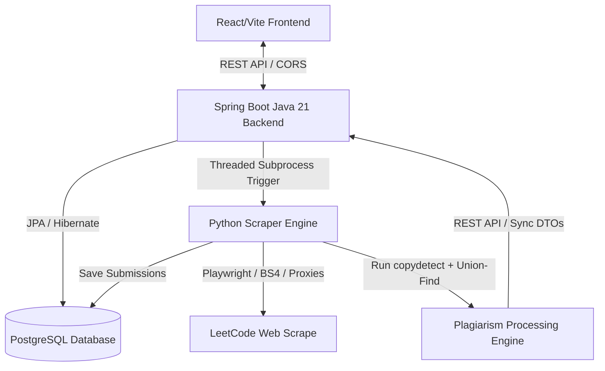

# Resemblance: LeetCode Plagiarism & Similarity Detection Engine

<div align="center">

*Automating competitive coding plagiarism detection, similarity clustering, and interactive code verification.*

<!-- BADGES -->


</div>

<br>

---

## 📑 Table of Contents
- [Overview](#-overview)
- [🏗️ System Architecture & Data Flow](#️-system-architecture--data-flow)
- [⚡ Core Features](#-core-features)
- [📂 Project Structure](#-project-structure)
    - [Project Index](#project-index)
- [⚙️ Configuration & Environment Variables](#️-configuration--environment-variables)
- [🚀 Setup & Execution](#-setup--execution)
- [🔌 API Endpoints Summary](#-api-endpoints-summary)
- [🛠️ Tech Stack](#️-tech-stack)

---

## 🔍 Overview

**Resemblance** is an end-to-end, high-performance distributed platform designed to automatically scrape competitive coding contests (specifically LeetCode Weekly and Biweekly contests), extract questions and user submissions, and run advanced code similarity checks to detect and cluster plagiarism groups in real-time. 

The system leverages a hybrid architecture combining a robust **Java 21 / Spring Boot** backend, high-fidelity **Python 3 / Playwright / BeautifulSoup** scraping and processing agents, and an interactive, real-time **React / Vite** dashboard.

---

## 🏗️ System Architecture & Data Flow

The platform is designed to handle high concurrency and large data volumes by decoupling the ingestion (scraping), computation (plagiarism detection), and visualization (dashboard) layers.



### Key Components
1. **Spring Boot Backend (`/Pro`)**:
   - Manages state, JPA entities (Contest, Question, Submission, Code, PlagiarismMatch), and transaction processing.
   - Integrates Rate Limiting, Request Size Filtering, CORS controls, and Admin-interceptors for secure endpoint access.
   - Leverages Java's subprocess builders to execute Python worker threads asynchronously.
2. **Python Scraper & Processor (`/data`)**:
   - **Ingestion**: Utilizes **Playwright** and **BeautifulSoup4** to crawl LeetCode contests. Supports proxy providers (Oxylabs, Scrape.do) to bypass anti-scraping and Cloudflare walls.
   - **Clustering Engine**: Runs **CopyDetect** to check pairwise similarities between files. Builds a Disjoint-Set Union (Union-Find) structure to assemble highly confident plagiarism clusters.
3. **Frontend Dashboard (`/similarity`)**:
   - Modern React + Vite Single Page Application.
   - Dynamic UI including Contest lists, Question breakdown, Plagiarism clusters (Solution groups), Side-by-side interactive code comparison (with highlighted diffs), and an Admin Database Populator.

---

## ⚡ Core Features

- **Automated Contest Crawler**: Extracts LeetCode contest metrics, difficulties, constraints, and complete user submission timelines (languages: C++, Java, Python, Go, JS, Rust, Kotlin).
- **Intelligent Plagiarism Clustering**: Combines structural similarity analysis with a **Union-Find (Disjoint-Set)** algorithm to group plagiarized codes instead of showing simple pairwise lists.
- **Side-by-Side Code Diffing**: Renders exact code lines side-by-side with similarity highlights.
- **Proxy Rotation & Backoff**: Built-in exponential backoff and proxy header authentication for resilient scraping.
- **Enterprise Controls**: Spring rate limiter, CORS origin checking, SMTP email triggers on administrative actions, and maximum tomcat request limits (2MB).
- **Docker Ready**: Fully containerized using multi-stage builds (Maven JRE + Python venv + Playwright setup).

---

## 📂 Project Structure

```sh
└── /
    ├── Dockerfile
    ├── Pro
    ├── data
    └── similarity
```

### Project Index

<details open>
<summary><b><code>/</code></b></summary>
<table style="width: 100%; border-collapse: collapse;">
<thead>
<tr style="background-color: #f8f9fa;">
<th style="width: 30%; text-align: left; padding: 8px;">File Name</th>
<th style="text-align: left; padding: 8px;">Summary</th>
</tr>
</thead>
<tr style="border-bottom: 1px solid #eee;">
<td style="padding: 8px;"><b><a href="/Dockerfile">Dockerfile</a></b></td>
<td style="padding: 8px;">Multi-stage container execution blueprint coordinating Java 21 compile step, Python environment configuration, and Playwright system setups.</td>
</tr>
<tr style="border-bottom: 1px solid #eee;">
<td style="padding: 8px;"><b><a href="/.gitignore">.gitignore</a></b></td>
<td style="padding: 8px;">Global rule descriptors containing paths to exclude from git tracking (e.g., node_modules, build targets, .venv).</td>
</tr>
</table>

<!-- Pro Submodule -->
<details open>
<summary><b>Pro (Spring Boot Backend)</b></summary>
<blockquote>
<div class="directory-path" style="padding: 8px 0; color: #666;">
<code><b>⦿ Pro</b></code>
</div>
<table style="width: 100%; border-collapse: collapse;">
<thead>
<tr style="background-color: #f8f9fa;">
<th style="width: 30%; text-align: left; padding: 8px;">File Name</th>
<th style="text-align: left; padding: 8px;">Summary</th>
</tr>
</thead>
<tr style="border-bottom: 1px solid #eee;">
<td style="padding: 8px;"><b><a href="/Pro/pom.xml">pom.xml</a></b></td>
<td style="padding: 8px;">Maven configuration project file specifying dependency management rules for Boot, JPA, Web, and SMTP modules.</td>
</tr>
<tr style="border-bottom: 1px solid #eee;">
<td style="padding: 8px;"><b><a href="/Pro/mvnw">mvnw</a> / <a href="/Pro/mvnw.cmd">mvnw.cmd</a></b></td>
<td style="padding: 8px;">Cross-platform execution wrappers standardizing Maven version requirements across development machines.</td>
</tr>
<tr style="border-bottom: 1px solid #eee;">
<td style="padding: 8px;"><b><a href="/Pro/src/main/resources/application.properties">application.properties</a></b></td>
<td style="padding: 8px;">Primary configuration parameters for database bindings, SMTP logins, CORS origins, and python script execution paths.</td>
</tr>
<tr style="border-bottom: 1px solid #eee;">
<td style="padding: 8px;"><b><a href="/Pro/src/main/java/HackMol/Pro/SimilarityApplication.java">SimilarityApplication.java</a></b></td>
<td style="padding: 8px;">Bootstrap entry class configuring component scans and launching the Spring application context.</td>
</tr>
</table>

<!-- Config -->
<details>
<summary><b>config</b></summary>
<blockquote>
<table style="width: 100%; border-collapse: collapse;">
<tr style="border-bottom: 1px solid #eee;">
<td style="width: 30%; padding: 8px;"><b>AdminAuthInterceptor.java</b></td>
<td style="padding: 8px;">Interceptor enforcing secret token verification for administrative database population operations.</td>
</tr>
<tr style="border-bottom: 1px solid #eee;">
<td style="width: 30%; padding: 8px;"><b>CorsConfig.java</b></td>
<td style="padding: 8px;">Handles cross-origin request configurations to whitelist frontend domains for backend REST routing.</td>
</tr>
<tr style="border-bottom: 1px solid #eee;">
<td style="width: 30%; padding: 8px;"><b>JacksonConfig.java</b></td>
<td style="padding: 8px;">Customizes JSON serializer and deserializer mappings for REST payloads.</td>
</tr>
<tr style="border-bottom: 1px solid #eee;">
<td style="width: 30%; padding: 8px;"><b>RateLimitingFilter.java</b></td>
<td style="padding: 8px;">Implements token-bucket rate-limiting filters (using Bucket4j) on endpoint routes to prevent API flooding.</td>
</tr>
<tr style="border-bottom: 1px solid #eee;">
<td style="width: 30%; padding: 8px;"><b>RequestSizeLimitFilter.java</b></td>
<td style="padding: 8px;">Filters out HTTP request payloads exceeding the specified maximum threshold of 2MB.</td>
</tr>
<tr style="border-bottom: 1px solid #eee;">
<td style="width: 30%; padding: 8px;"><b>WebConfig.java</b></td>
<td style="padding: 8px;">Registers interceptors and maps security filtering parameters to active web resource contexts.</td>
</tr>
</table>
</blockquote>
</details>

<!-- Controller -->
<details>
<summary><b>controller</b></summary>
<blockquote>
<table style="width: 100%; border-collapse: collapse;">
<tr style="border-bottom: 1px solid #eee;">
<td style="width: 30%; padding: 8px;"><b>CodeController.java</b></td>
<td style="padding: 8px;">Exposes routes to retrieve raw code content associated with a given user submission.</td>
</tr>
<tr style="border-bottom: 1px solid #eee;">
<td style="width: 30%; padding: 8px;"><b>ContactController.java</b></td>
<td style="padding: 8px;">Exposes the backend interface to receive contact form requests and trigger administrative emails.</td>
</tr>
<tr style="border-bottom: 1px solid #eee;">
<td style="width: 30%; padding: 8px;"><b>ContestController.java</b></td>
<td style="padding: 8px;">Exposes endpoints to query the list of saved contests and their corresponding questions.</td>
</tr>
<tr style="border-bottom: 1px solid #eee;">
<td style="width: 30%; padding: 8px;"><b>DatabasePopulationController.java</b></td>
<td style="padding: 8px;">Triggers the background python scrapers to fetch and populate questions, submissions, and code into the database.</td>
</tr>
<tr style="border-bottom: 1px solid #eee;">
<td style="width: 30%; padding: 8px;"><b>HealthController.java</b></td>
<td style="padding: 8px;">Simplistic endpoint returning service uptime and status for checkup probes.</td>
</tr>
<tr style="border-bottom: 1px solid #eee;">
<td style="width: 30%; padding: 8px;"><b>PlagiarismController.java</b></td>
<td style="padding: 8px;">Initiates similarity engine runs and queries match details between solutions.</td>
</tr>
<tr style="border-bottom: 1px solid #eee;">
<td style="width: 30%; padding: 8px;"><b>QuestionController.java</b></td>
<td style="padding: 8px;">Manages query routes for specific coding challenge descriptions.</td>
</tr>
<tr style="border-bottom: 1px solid #eee;">
<td style="width: 30%; padding: 8px;"><b>SubmissionsController.java</b></td>
<td style="padding: 8px;">Retrieves user submission timelines and maps metadata for coding solutions.</td>
</tr>
</table>
</blockquote>
</details>

<!-- Models & Repositories -->
<details>
<summary><b>model & repository</b></summary>
<blockquote>
<table style="width: 100%; border-collapse: collapse;">
<tr style="border-bottom: 1px solid #eee;">
<td style="width: 30%; padding: 8px;"><b>Code.java</b></td>
<td style="padding: 8px;">JPA database entity containing raw solution code.</td>
</tr>
<tr style="border-bottom: 1px solid #eee;">
<td style="width: 30%; padding: 8px;"><b>Contest.java</b></td>
<td style="padding: 8px;">JPA database entity storing contest titles, slug URLs, and dates.</td>
</tr>
<tr style="border-bottom: 1px solid #eee;">
<td style="width: 30%; padding: 8px;"><b>Difficulty.java</b></td>
<td style="padding: 8px;">Enum representing problem levels (Easy, Medium, Hard).</td>
</tr>
<tr style="border-bottom: 1px solid #eee;">
<td style="width: 30%; padding: 8px;"><b>PlagiarismMatch.java</b></td>
<td style="padding: 8px;">Stores similarity metrics and references for two duplicate submissions.</td>
</tr>
<tr style="border-bottom: 1px solid #eee;">
<td style="width: 30%; padding: 8px;"><b>Question.java</b></td>
<td style="padding: 8px;">Represents LeetCode questions, linking them to parent contests.</td>
</tr>
<tr style="border-bottom: 1px solid #eee;">
<td style="width: 30%; padding: 8px;"><b>Submission.java</b></td>
<td style="padding: 8px;">Stores contest entry details, execution status, and programming languages.</td>
</tr>
<tr style="border-bottom: 1px solid #eee;">
<td style="width: 30%; padding: 8px;"><b>*Repository.java</b></td>
<td style="padding: 8px;">Data access layers (Spring Data JPA interfaces) for Code, Contest, PlagiarismMatch, Question, and Submission tables.</td>
</tr>
</table>
</blockquote>
</details>

<!-- Services -->
<details>
<summary><b>services</b></summary>
<blockquote>
<table style="width: 100%; border-collapse: collapse;">
<tr style="border-bottom: 1px solid #eee;">
<td style="width: 30%; padding: 8px;"><b>CodeService.java</b></td>
<td style="padding: 8px;">Handles database CRUD operations for storing and fetching submission code.</td>
</tr>
<tr style="border-bottom: 1px solid #eee;">
<td style="width: 30%; padding: 8px;"><b>ContestService.java</b></td>
<td style="padding: 8px;">Orchestrates contest registration and handles listing queries.</td>
</tr>
<tr style="border-bottom: 1px solid #eee;">
<td style="width: 30%; padding: 8px;"><b>EmailService.java</b></td>
<td style="padding: 8px;">Configures SMTP client configurations and fires contact messages to administrators.</td>
</tr>
<tr style="border-bottom: 1px solid #eee;">
<td style="width: 30%; padding: 8px;"><b>PlagiarismService.java</b></td>
<td style="padding: 8px;">Orchestrates plagiarism checks and processes text similarity.</td>
</tr>
<tr style="border-bottom: 1px solid #eee;">
<td style="width: 30%; padding: 8px;"><b>QuestionService.java</b></td>
<td style="padding: 8px;">Provides question detail query APIs and validation logic.</td>
</tr>
<tr style="border-bottom: 1px solid #eee;">
<td style="width: 30%; padding: 8px;"><b>ResultsService.java</b></td>
<td style="padding: 8px;">Aggregates overall statistics for visual analytics.</td>
</tr>
</table>
</blockquote>
</details>
</blockquote>
</details>

<!-- data Submodule -->
<details open>
<summary><b>data (Python Scraper & Processor)</b></summary>
<blockquote>
<div class="directory-path" style="padding: 8px 0; color: #666;">
<code><b>⦿ data</b></code>
</div>
<table style="width: 100%; border-collapse: collapse;">
<thead>
<tr style="background-color: #f8f9fa;">
<th style="width: 30%; text-align: left; padding: 8px;">File Name</th>
<th style="text-align: left; padding: 8px;">Summary</th>
</tr>
</thead>
<tr style="border-bottom: 1px solid #eee;">
<td style="padding: 8px;"><b><a href="/data/requirements.txt">requirements.txt</a></b></td>
<td style="padding: 8px;">Specifies required libraries (boto3, BeautifulSoup4, copydetect, playwright) for scraping/processing tasks.</td>
</tr>
<tr style="border-bottom: 1px solid #eee;">
<td style="padding: 8px;"><b><a href="/data/entrypoint.py">entrypoint.py</a></b></td>
<td style="padding: 8px;">CLI target runner. Resolves the <code>TASK</code> environment variable to run specific scrapers or processor handlers.</td>
</tr>
<tr style="border-bottom: 1px solid #eee;">
<td style="padding: 8px;"><b><a href="/data/login.py">login.py</a></b></td>
<td style="padding: 8px;">Automates login validation workflow on LeetCode utilizing Playwright.</td>
</tr>
<tr style="border-bottom: 1px solid #eee;">
<td style="padding: 8px;"><b><a href="/data/api_client/">api_client/</a></b></td>
<td style="padding: 8px;">Directory containing the auto-generated SDK client library to interface with the Java REST backend securely.</td>
</tr>
<tr style="border-bottom: 1px solid #eee;">
<td style="padding: 8px;"><b><a href="/data/processing/copydetect/run.py">processing/copydetect/run.py</a></b></td>
<td style="padding: 8px;">Initializes the <code>copydetect</code> engine, compares solutions, groups matches via Union-Find, and pushes plagiarism groups back to the REST API.</td>
</tr>
<tr style="border-bottom: 1px solid #eee;">
<td style="padding: 8px;"><b><a href="/data/processing/utils/union_find.py">processing/utils/union_find.py</a></b></td>
<td style="padding: 8px;">Implements the Disjoint-Set Union (Union-Find) algorithm used to cluster similar solutions into groups.</td>
</tr>
<tr style="border-bottom: 1px solid #eee;">
<td style="padding: 8px;"><b><a href="/data/scraping/contest/run.py">scraping/contest/run.py</a></b></td>
<td style="padding: 8px;">Crawls LeetCode contest metadata. Features Oxylabs/Scrape.do rotating proxy integrations to prevent IP bans.</td>
</tr>
<tr style="border-bottom: 1px solid #eee;">
<td style="padding: 8px;"><b><a href="/data/scraping/questions/run.py">scraping/questions/run.py</a></b></td>
<td style="padding: 8px;">Crawls question metadata and constraints for a given contest slug.</td>
</tr>
<tr style="border-bottom: 1px solid #eee;">
<td style="padding: 8px;"><b><a href="/data/scraping/submissions/run.py">scraping/submissions/run.py</a></b></td>
<td style="padding: 8px;">Extracts submission codes of participants using LeetCode API schemas.</td>
</tr>
</table>
</blockquote>
</details>

<!-- similarity Submodule -->
<details open>
<summary><b>similarity (React Frontend)</b></summary>
<blockquote>
<div class="directory-path" style="padding: 8px 0; color: #666;">
<code><b>⦿ similarity</b></code>
</div>
<table style="width: 100%; border-collapse: collapse;">
<thead>
<tr style="background-color: #f8f9fa;">
<th style="width: 30%; text-align: left; padding: 8px;">File Name</th>
<th style="text-align: left; padding: 8px;">Summary</th>
</tr>
</thead>
<tr style="border-bottom: 1px solid #eee;">
<td style="padding: 8px;"><b><a href="/similarity/package.json">package.json</a></b></td>
<td style="padding: 8px;">Metadata file detailing UI dependency configurations (React, Axios, React Router, ESLint).</td>
</tr>
<tr style="border-bottom: 1px solid #eee;">
<td style="padding: 8px;"><b><a href="/similarity/vite.config.js">vite.config.js</a></b></td>
<td style="padding: 8px;">React bundler parameters mapping compile targets and local server settings.</td>
</tr>
<tr style="border-bottom: 1px solid #eee;">
<td style="padding: 8px;"><b><a href="/similarity/index.html">index.html</a></b></td>
<td style="padding: 8px;">HTML entry template injecting React DOM context root hook.</td>
</tr>
<tr style="border-bottom: 1px solid #eee;">
<td style="padding: 8px;"><b><a href="/similarity/src/App.jsx">src/App.jsx</a></b></td>
<td style="padding: 8px;">Orchestrates frontend navigation paths, layouts, and routing controls.</td>
</tr>
<tr style="border-bottom: 1px solid #eee;">
<td style="padding: 8px;"><b><a href="/similarity/src/main.jsx">src/main.jsx</a></b></td>
<td style="padding: 8px;">Vite JS startup entry executing DOM bindings inside strict mode checking.</td>
</tr>
<tr style="border-bottom: 1px solid #eee;">
<td style="padding: 8px;"><b><a href="/similarity/src/CodeView.jsx">src/CodeView.jsx</a></b></td>
<td style="padding: 8px;">View container displaying the raw source code of individual submissions.</td>
</tr>
<tr style="border-bottom: 1px solid #eee;">
<td style="padding: 8px;"><b><a href="/similarity/src/CompareCode.jsx">src/CompareCode.jsx</a></b></td>
<td style="padding: 8px;">Renders two code structures side-by-side, visually highlighting matched similarities.</td>
</tr>
<tr style="border-bottom: 1px solid #eee;">
<td style="padding: 8px;"><b><a href="/similarity/src/Contests.jsx">src/Contests.jsx</a></b></td>
<td style="padding: 8px;">Lists all available coding contests that have been scraped and stored.</td>
</tr>
<tr style="border-bottom: 1px solid #eee;">
<td style="padding: 8px;"><b><a href="/similarity/src/ContestQuestions.jsx">src/ContestQuestions.jsx</a></b></td>
<td style="padding: 8px;">Displays the grid of question details matching a selected contest.</td>
</tr>
<tr style="border-bottom: 1px solid #eee;">
<td style="padding: 8px;"><b><a href="/similarity/src/SolutionDetails.jsx">src/SolutionDetails.jsx</a></b></td>
<td style="padding: 8px;">Shows clustered plagiarism results, groups, and similarity percentages for a question.</td>
</tr>
<tr style="border-bottom: 1px solid #eee;">
<td style="padding: 8px;"><b><a href="/similarity/src/LeaderBoard.jsx">src/LeaderBoard.jsx</a></b></td>
<td style="padding: 8px;">Displays score lists and lists profiles showing high counts of duplicate solutions.</td>
</tr>
<tr style="border-bottom: 1px solid #eee;">
<td style="padding: 8px;"><b><a href="/similarity/src/DatabasePopulator.jsx">src/DatabasePopulator.jsx</a></b></td>
<td style="padding: 8px;">Dashboard utility mapping a trigger panel to send crawl requests to the backend.</td>
</tr>
<tr style="border-bottom: 1px solid #eee;">
<td style="padding: 8px;"><b><a href="/similarity/src/HomePage.jsx">src/HomePage.jsx</a></b></td>
<td style="padding: 8px;">Main entry landing route view controller.</td>
</tr>
</table>
</blockquote>
</details>
</details>

---

## ⚙️ Configuration & Environment Variables

The project contains several configuration environments that must be filled.

### 1. Spring Boot Backend Configuration (`Pro/src/main/resources/application.properties`)
```properties
# Database URL (PostgreSQL Neon Tech / AWS Relational DB)
spring.datasource.url=jdbc:postgresql://<host>/neondb?sslmode=require
spring.datasource.username=<username>
spring.datasource.password=<password>

# SMTP Config (Gmail)
spring.mail.host=smtp.gmail.com
spring.mail.port=587
spring.mail.username=<email>
spring.mail.password=<app-password>

# Scraper Settings
scraper.python-path=python
scraper.script-path=/app/data/scraping/submissions/run.py
scraper.work-dir=/app/data
scraper.api-base-url=http://localhost:8080
admin.secret-key=<long-secret-key>
```

### 2. Python Scraper & Processor `.env` (`data/.env`)
```env
LOG_LEVEL=INFO
API_BASE_URL=http://localhost:8080
ADMIN_SECRET_KEY=<long-secret-key>
CONTEST_SLUG=weekly-contest-400

# Proxy Configurations (Optional, required for LeetCode)
OXYLABS_CREDENTIALS=username:password
# OR
SCRAPEDO_TOKEN=your-scrape-do-token
```

### 3. Frontend `.env` (`similarity/.env`)
```env
VITE_API_URL=http://localhost:8080/api/v1
```

---

## 🚀 Setup & Execution

### Option A: Local Development (Manual Setup)

#### 1. Start the PostgreSQL Database
Make sure you have a running PostgreSQL instance matching your configurations.

#### 2. Run the Java Backend
Navigate to the `Pro` directory:
```bash
cd Pro
# Build the project
mvn clean install
# Start the Spring Boot App
mvn spring-boot:run
```
The server will start on [http://localhost:8080](http://localhost:8080).

#### 3. Setup the Python Virtual Environment
Navigate to the `data` directory:
```bash
cd data
python3 -m venv .venv

# Activate venv:
# Windows:
.venv\Scripts\activate
# Linux/macOS:
source .venv/bin/activate

# Install requirements
pip install -r requirements.txt
pip install ./api_client

# Install Playwright browser dependencies
playwright install chromium
playwright install-deps
```

To run tasks directly:
```bash
export TASK="processing/copydetect"
export CONTEST_SLUG="weekly-contest-400"
python entrypoint.py
```

#### 4. Run the React Frontend
Navigate to the `similarity` directory:
```bash
cd similarity
npm install
npm run dev
```
The frontend will start on [http://localhost:5173](http://localhost:5173).

---

### Option B: Run via Docker (Unified Runtime)

A multi-stage runtime Dockerfile is provided at the root directory. It compiles the Java binary, setups Python JRE environments, compiles Playwright, and starts the unified container.

#### Build the Docker image
```bash
docker build -t pro-clean-engine .
```

#### Run the container
```bash
docker run -p 8080:8080 \
  -e spring.datasource.url=jdbc:postgresql://<host>/neondb \
  -e spring.datasource.username=<username> \
  -e spring.datasource.password=<password> \
  pro-clean-engine
```

---

## 🔌 API Endpoints Summary

Here are the key REST endpoints exposed by the Java Backend:

### Database Ingestion & Scrapers
- `POST /api/v1/admin/scrape` : Triggers background python scrape jobs.
  - Params: `start` (int), `end` (int), `type` ("weekly" / "biweekly")

### Contests & Questions
- `GET /api/v1/contests` : Retrieves all tracked contests.
- `GET /api/v1/contest/{slug}/questions` : Fetches questions associated with a contest.

### Plagiarism & Similarity
- `POST /api/v1/plagiarism/run/{questionId}` : Runs the Plagiarism Engine on code submissions.
- `GET /api/v1/plagiarism/submissions/{submissionId}` : Retrieves similar solutions for a given submission ID.
- `GET /api/v1/code/{submissionId}` : Retrieves the source code for a submission.

---

## 🛠️ Tech Stack

- **Backend**: Java 21, Spring Boot, Hibernate, PostgreSQL, Maven, JPlag
- **Frontend**: React, Vite, ES6 Javascript, Axios, React Router, CSS
- **Scraper / Clustering Engine**: Python 3, Playwright, BeautifulSoup4, CopyDetect (Plagiarism checker)
- **Deployment**: Docker (Multi-stage), Oracle Cloud, Vercel