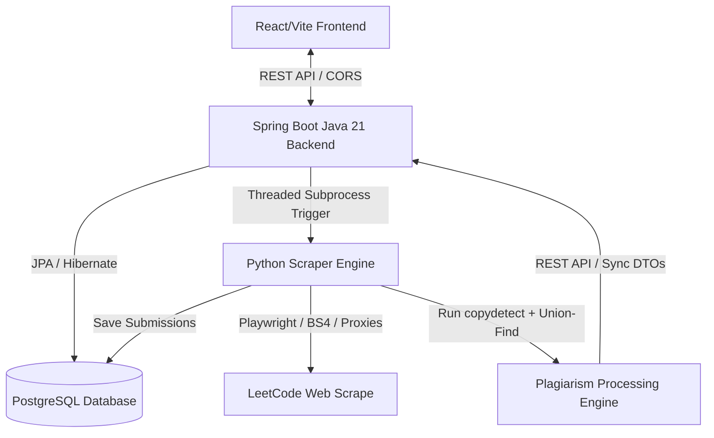

# Resemblance: LeetCode Plagiarism & Similarity Detection Engine

<div align="center">

*Automating competitive coding plagiarism detection, similarity clustering, and interactive code verification.*

<!-- BADGES -->


</div>

<br>

---

## 📑 Table of Contents
- [Overview](#-overview)
- [🏗️ System Architecture & Data Flow](#️-system-architecture--data-flow)
- [⚡ Core Features](#-core-features)
- [📂 Project Structure](#-project-structure)
- [⚙️ Configuration & Environment Variables](#️-configuration--environment-variables)
- [🚀 Setup & Execution](#-setup--execution)
- [🔌 API Endpoints Summary](#-api-endpoints-summary)
- [🛠️ Tech Stack](#️-tech-stack)

---

## 🔍 Overview

**Resemblance** is an end-to-end, high-performance distributed platform designed to automatically scrape competitive coding contests, extract questions and user submissions, and run advanced code similarity checks to detect and cluster plagiarism groups in real-time. 

The system leverages a hybrid architecture combining a robust **Java 21 / Spring Boot** backend, high-fidelity **Python 3 / Playwright** scraping and processing agents, and an interactive, real-time **React / Vite** dashboard.

---

## 🏗️ System Architecture & Data Flow

The platform is designed to handle high concurrency and large data volumes by decoupling the ingestion (scraping), computation (plagiarism detection), and visualization (dashboard) layers.



### Key Components
1. **Spring Boot Backend (`/Pro`)**:
   - Manages state, JPA entities (Contest, Question, Submission, Code, PlagiarismMatch), and transaction processing.
   - Integrates Rate Limiting, Request Size Filtering, CORS controls, and Admin-interceptors for secure endpoint access.
   - Leverages Java's subprocess builders to execute Python worker threads asynchronously.
2. **Python Scraper & Processor (`/data`)**:
   - **Ingestion**: Utilizes **Playwright** and **BeautifulSoup4** to crawl LeetCode contests. Supports proxy providers (Oxylabs, Scrape.do) to bypass anti-scraping and Cloudflare walls.
   - **Clustering Engine**: Runs **CopyDetect** to check pairwise similarities between files. Builds a Disjoint-Set Union (Union-Find) structure to assemble highly confident plagiarism clusters.
3. **Frontend Dashboard (`/similarity`)**:
   - Modern React + Vite Single Page Application.
   - Dynamic UI including Contest lists, Question breakdown, Plagiarism clusters (Solution groups), Side-by-side interactive code comparison (with highlighted diffs), and an Admin Database Populator.

---

## ⚡ Core Features

- **Automated Contest Crawler**: Extracts LeetCode contest metrics, difficulties, constraints, and complete user submission timelines (languages: C++, Java, Python, Go, JS, Rust, Kotlin).
- **Intelligent Plagiarism Clustering**: Combines structural similarity analysis with a **Union-Find (Disjoint-Set)** algorithm to group plagiarized codes instead of showing simple pairwise lists.
- **Side-by-Side Code Diffing**: Renders exact code lines side-by-side with similarity highlights.
- **Proxy Rotation & Backoff**: Built-in exponential backoff and proxy header authentication for resilient scraping.
- **Enterprise Controls**: Spring rate limiter, CORS origin checking, SMTP email triggers on administrative actions, and maximum tomcat request limits (2MB).
- **Docker Ready**: Fully containerized using multi-stage builds (Maven JRE + Python venv + Playwright setup).

---

## 📂 Project Structure

```sh
└── /
    ├── Dockerfile                   # Multi-stage production container build rules
    ├── Pro/                         # Java 21 / Spring Boot Web Service
    │   ├── pom.xml                  # Maven Dependencies (Security, JPA, Web, Mail)
    │   └── src/
    │       ├── main/
    │       │   ├── java/HackMol/Pro/
    │       │   │   ├── config/      # Filters, CORS, and admin auth interceptors
    │       │   │   ├── controller/  # REST APIs (Contests, Submissions, Plagiarism check)
    │       │   │   ├── dto/         # Data Transfer Objects mapping JSON parameters
    │       │   │   ├── model/       # JPA Database Schema entities
    │       │   │   └── services/    # Business rules, Plagiarism check trigger, SMTP setup
    │       │   └── resources/
    │       │       └── application.properties # Database connection & worker paths
    │       └── test/                # Core unit testing for plagiarism routines
    ├── data/                        # Python Ingestion & Analytics Module
    │   ├── requirements.txt         # Scraper, playright, copydetect libraries
    │   ├── entrypoint.py            # CLI wrapper executing script tasks via env args
    │   ├── api_client/              # Auto-generated API client code binding to Java REST endpoints
    │   ├── processing/
    │   │   └── copydetect/
    │   │       └── run.py           # Main copydetect algorithm and DSU grouping logic
    │   └── scraping/
    │       ├── contest/             # Core Leetcode portal crawler
    │       ├── questions/           # Question descriptor and metadata parser
    │       └── submissions/         # Ingestion scripts for user solutions
    └── similarity/                  # React + Vite Client Dashboard
        ├── package.json             # Dev tools and NPM libraries config
        ├── vite.config.js           # Development proxy and loader configs
        └── src/
            ├── App.jsx              # Application router setting layout viewports
            ├── main.jsx             # React DOM renderer entry point
            ├── CompareCode.jsx      # Side-by-side diff code highlighted grid
            ├── Contests.jsx         # Contest selection layout page
            ├── LeaderBoard.jsx      # Plagiarism metrics and contestant scores grid
            └── DatabasePopulator.jsx # Admin trigger interface for background crawlers
```

---

## ⚙️ Configuration & Environment Variables

The project contains several configuration environments that must be filled.

### 1. Spring Boot Backend Configuration (`Pro/src/main/resources/application.properties`)
```properties
# Database URL (PostgreSQL Neon Tech / AWS Relational DB)
spring.datasource.url=jdbc:postgresql://<host>/neondb?sslmode=require
spring.datasource.username=<username>
spring.datasource.password=<password>

# SMTP Config (Gmail)
spring.mail.host=smtp.gmail.com
spring.mail.port=587
spring.mail.username=<email>
spring.mail.password=<app-password>

# Scraper Settings
scraper.python-path=python
scraper.script-path=/app/data/scraping/submissions/run.py
scraper.work-dir=/app/data
scraper.api-base-url=http://localhost:8080
admin.secret-key=<long-secret-key>
```

### 2. Python Scraper & Processor `.env` (`data/.env`)
```env
LOG_LEVEL=INFO
API_BASE_URL=http://localhost:8080
ADMIN_SECRET_KEY=<long-secret-key>
CONTEST_SLUG=weekly-contest-400

# Proxy Configurations (Optional, required for LeetCode)
OXYLABS_CREDENTIALS=username:password
# OR
SCRAPEDO_TOKEN=your-scrape-do-token

# AWS Step Functions configuration (Optional)
TASK_TOKEN=your-step-functions-task-token
```

### 3. Frontend `.env` (`similarity/.env`)
```env
VITE_API_URL=http://localhost:8080/api/v1
```

---

## 🚀 Setup & Execution

### Option A: Local Development (Manual Setup)

#### 1. Start the PostgreSQL Database
Make sure you have a running PostgreSQL instance matching your configurations.

#### 2. Run the Java Backend
Navigate to the `Pro` directory:
```bash
cd Pro
# Build the project
mvn clean install
# Start the Spring Boot App
mvn spring-boot:run
```
The server will start on [http://localhost:8080](http://localhost:8080).

#### 3. Setup the Python Virtual Environment
Navigate to the `data` directory:
```bash
cd data
python3 -m venv .venv

# Activate venv:
# Windows:
.venv\Scripts\activate
# Linux/macOS:
source .venv/bin/activate

# Install requirements
pip install -r requirements.txt
pip install ./api_client

# Install Playwright browser dependencies
playwright install chromium
playwright install-deps
```

To run tasks directly:
```bash
export TASK="processing/copydetect"
export CONTEST_SLUG="weekly-contest-400"
python entrypoint.py
```

#### 4. Run the React Frontend
Navigate to the `similarity` directory:
```bash
cd similarity
npm install
npm run dev
```
The frontend will start on [http://localhost:5173](http://localhost:5173).

---

### Option B: Run via Docker (Unified Runtime)

A multi-stage runtime Dockerfile is provided at the root directory. It compiles the Java binary, setups Python JRE environments, compiles Playwright, and starts the unified container.

#### Build the Docker image
```bash
docker build -t pro-clean-engine .
```

#### Run the container
```bash
docker run -p 8080:8080 \
  -e spring.datasource.url=jdbc:postgresql://<host>/neondb \
  -e spring.datasource.username=<username> \
  -e spring.datasource.password=<password> \
  pro-clean-engine
```

---

## 🔌 API Endpoints Summary

Here are the key REST endpoints exposed by the Java Backend:

### Database Ingestion & Scrapers
- `POST /api/v1/admin/scrape` : Triggers background python scrape jobs.
  - Params: `start` (int), `end` (int), `type` ("weekly" / "biweekly")

### Contests & Questions
- `GET /api/v1/contests` : Retrieves all tracked contests.
- `GET /api/v1/contest/{slug}/questions` : Fetches questions associated with a contest.

### Plagiarism & Similarity
- `POST /api/v1/plagiarism/run/{questionId}` : Runs the Plagiarism Engine on code submissions.
- `GET /api/v1/plagiarism/submissions/{submissionId}` : Retrieves similar solutions for a given submission ID.
- `GET /api/v1/code/{submissionId}` : Retrieves the source code for a submission.

---

## 🛠️ Tech Stack

- **Backend**: Java 21, Spring Boot, Hibernate, PostgreSQL, Maven, JPlag
- **Frontend**: React, Vite, ES6 Javascript, Axios, React Router, CSS
- **Scraper / Clustering Engine**: Python 3, Playwright, BeautifulSoup4
- **Deployment**: Docker (Multi-stage), Oracle Cloud, Vercel